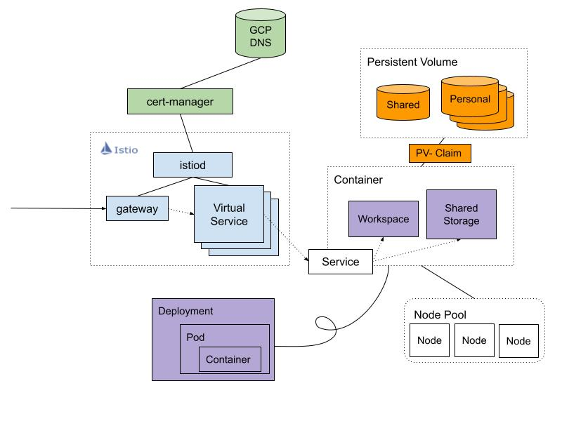

# 쿠버네티스

## P2P 쿠버네티스 구성도

### Node Pool
- 노드들의 군집으로, 노드들의 라벨로 노드를 군집화한다. 여기서 노드란 하나의 머신을 의미하며 머신에는 컨테이너들이 할당된다.

### Persistent Volume
- 물리 디스크로, 줄여서 PV 라고 한다. PV 는 PV Claim 이라는 논리적인 쿠버네티스 오브젝트에 의해서 컨테이너의 특정 경로에 마운트가 된다.

### Container
- 정확히는 파드를 관리하는 쿠버네티스 Deployment 가 있고, 파드에는 여러 컨테이너가 존재할 수 있다.
- 컨테이너는 쿠버네티스 서비스 오브젝트를 통해서 외부에 노출한다.

### ISTIO
- 마이크로서비스 아키텍쳐에서 많이 사용되는 서비스 메쉬로, 서비스 메쉬란 각 서비스 별로 envoy 같은 프록시 서버(사이드카)를 배치하여 매쉬 네트워크를 구성함으로써 앱 서비스와 네트워크 계층에 대한 독립성을 보장한다. 즉 앱 서비스 구현단계에서 네트워크 계층을 고려할 필요 없어진다.
- ISTIO 는 많은 기능들이 있지만 현재는 service discovery 용도로 사용되고 있으며 서브 도메인({서브 도메인}.c1.ainetwork.ai)를 통해서 컨테이너를 연결한다. 연결은 Virtual Service 라는 쿠버네티스 오브젝트를 이용해서 특정 서브 도메인으로 접근하면 특정 서비스 오브젝트로 전달한다.

### Cert Manager
- TLS인증서를 자동으로 프로비저닝 및 관리하는 서비스로, GCP DNS 와 직접 연결하여 Wildcard 도메인 인증서를 자동으로 프로비저닝하도록 설정할 수 있다. 
- Wildcard 도메인 인증서는 DNS01 인증 방식만 지원하면 DNS01 인증 방식은 도메인 서비스에 TXT 레코드로 인증코드를 넣는 방식으로 인증하며 이것들은 Cert Manager 가 알아서 해준다. 

# MS Azure 웹 콘솔

## 생성된 워크스페이스 리스트

## 생성된 스토리지 리스트
